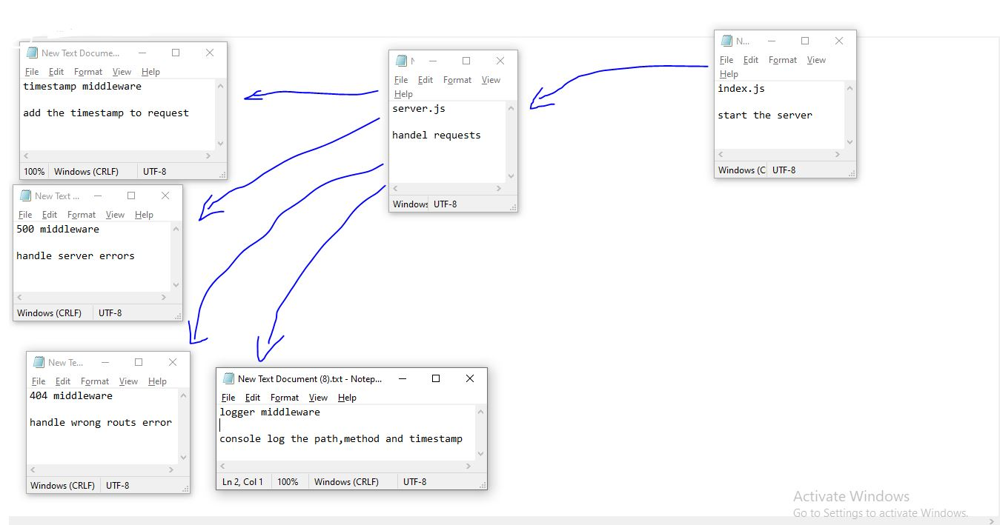

# LAB - Class 15

## Project: HTTP and REST

### Author: Ruwaid al sayyed obeid

### Links and Resources

- [submission PR](https://github.com/ruwaid-401-advanced-javascript/api-server/pull/1)
- [Github actions](https://github.com/ruwaid-401-advanced-javascript/api-server/pull/1/checks)

### Documentaion
* EndPoint: `/docs` 

## Modules
### server.js
### 404.js
### 500.js

### Setup
#### .env requirements
* PORT - Port Number
* MONGODB_URI - mongoDB url
* SECRET - token secret
* CLIENT_ID - for github
* CLIENT_SECRET - for github
* EXPIRE - time for token to expire
* AUTH - t start/stop the autherization & athentication ('ON' or 'OFF)

#### How to initialize/run your application 
* `npm start`
* EndPoint: `/` 
* EndPoint: `/docs` 
* EndPoint: `/api/v1/categories` 
* EndPoint: `/api/v1/products`
* EndPoint: `/signin`
* EndPoint: `/signup`
* EndPoint: `/login`

#### How to use your library 
#### Tests
- Lint test: `npm run lint`
- unit test: `npm test`

#### UML

